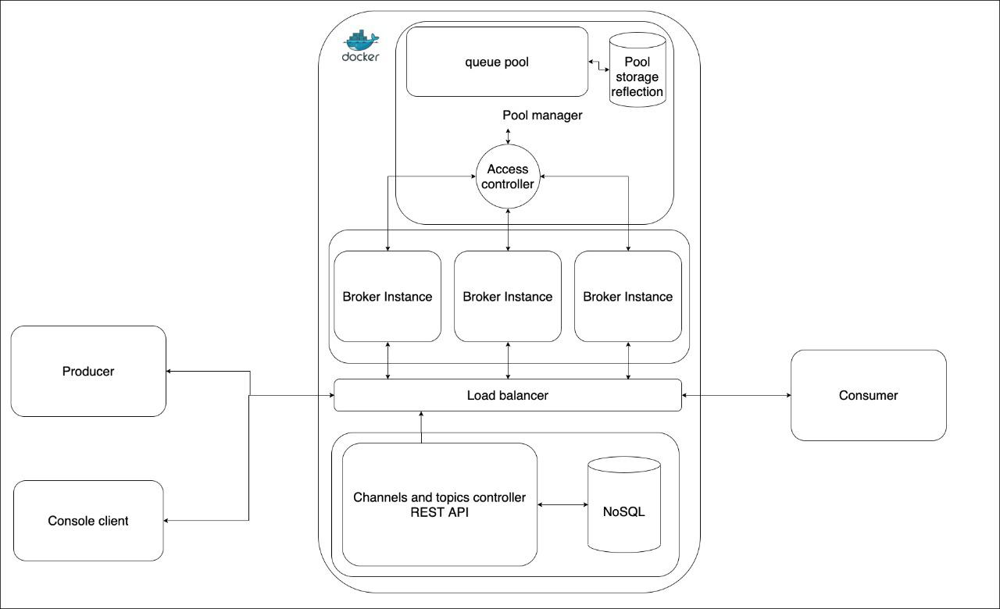
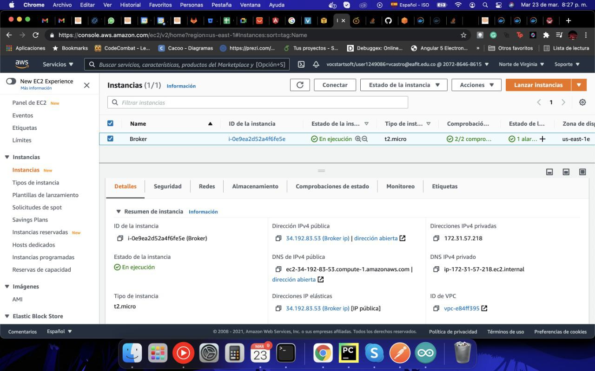
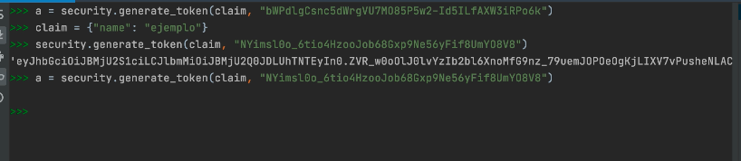

# Requerimientos del proyecto

- El proyecto busca implementar un middelware, el cual actúa de intermediario entre la comunicación dentro del desarrollo.
- Se necesita una aplicación cliente.
- Dentro de la aplicación deben existir diferentes elementos para cumplir funciones, entre los principales están canales, publicadores , consumidores.
    - *Canales:* cumplen la función de ser el intermedio entre los consumidores y el publicador de un mensaje, este crea una cola para cada consumidor conectado y una vez se envíe un mensaje en el canal, almacena el mensaje en cada una de esas colas.  
    - *Consumidores:* son los que reciben los mensajes que están en sus respectivas colas, es decir hacen un pull de los mensajes almacenados.
    - *Publicadores:* Son aquellos que envían los mensajes al canal.

- Se busca que la aplicación sea desplegada en la nube.

# Análisis y diseño: 

El lenguaje de programación que elegimos fue Python, específicamente trabajmos con el framework Flask, debido a que es un framework que conocemos y facilitaba el despliegue en una maquina virtual. 

Mediante el análisis decidimos plantear el proyecto con un broker y un servidor cliente. el Broker mantiene actualizado los canales y a través de un socket TCP/IP revisa constantemente las conexiones de los clientes y si un cliente se suscribe a un canal. Óptamos porque a el canal se pudiese suscribir un número x de usuarios y por cada uno de estos usuarios y solo cuando se conectaran creará su respectiva cola, además existe un sistema de autentificación de usuarios y por último decidimos desplegarla en una maquina EC2 de AWS. la arquitectura que diseñamos para cumplir con lo de este análisis fue: 

### EC2

# APLICACIÓN: 

1) Se pueden crear diferentes usuarios
2) Se pueden obtener todos los usuarios o un usuario específico.
3) Se puede eliminar un usuario.
4) Se puede crear un canal. 
5) Se pueden visualizar los canales.
6) Se pueden eliminar canales.
7) Se puede añadir una cola al canal (suscribirse)
8) Se pueden visualizar las colas de un canal.
9) Se pueden eliminar colas de un canal.
10) Se puede enviar un mensaje al canal.

**PD1:** No realizamos interfaz de usuario, por ende todos los procedimientos se hacen por medio de llamados desde postman. (El archivo con los llamados estará ubicado en la carpeta "llamados", un archivo .json)

**PD2:** Para las operaciones donde se necesite ingresar algún parametro por seguridad, se debe crear un claim con el nombre del usuario, o del parametro, y firmarlo con la llave, esto generará el payload necesario para ejectuar el llamado por postman. 

 

**Ip del broker:** http://34.192.83.53:5000

**IP del cliente:** http://3.227.225.31:5000

